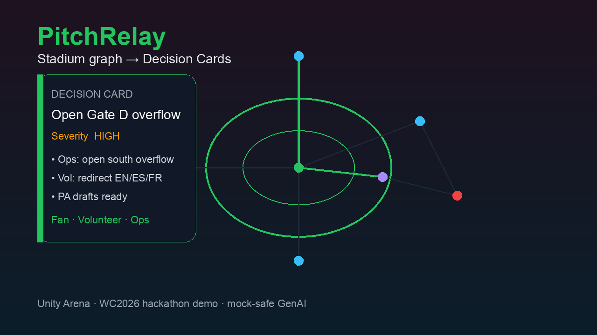

# PitchRelay

**GenAI decision relay on a live stadium knowledge graph** — for fans, volunteers, and ops during FIFA World Cup 2026-style match days.



> Not another chatbot skin. PitchRelay’s wedge is a **shared venue graph**, **ADA-native pathfinding**, and **Zod-validated Decision Cards** (who / what / where / comms drafts) with mock-safe GenAI.

**Venue:** *Unity Arena* — original fictional host stadium profile (not affiliated with FIFA).

## Features

- **Stadium knowledge graph** (Unity Arena) with zones, gates, elevators, medical posts, transport hubs
- **Pathfinding** with ADA mode (elevators/ramps only — no stairs)
- **Telemetry simulator** + risk scoring + sustainability meters
- **Fan Assist** — multilingual grounded answers + route highlight + citations
- **Volunteer Desk** — task cards, phrase chips, escalate to ops
- **Ops Console** — zone board, incident inbox, Decision Cards, scenario runner
- **GenAI** — optional OpenAI / Gemini; **deterministic mock by default**
- **RAG** over `data/kb/*.md` + graph facts
- **Vitest** domain tests

## Quick start

```bash
# Node 20+
npm install
npm test
npm run dev
# → http://localhost:3000
```

Optional live LLM (otherwise mock mode):

```bash
cp .env.example .env.local
# set OPENAI_API_KEY or GEMINI_API_KEY and LLM_PROVIDER
```

Production build:

```bash
npm run build && npm start
```

Generate project image:

```bash
npm run generate:image
```

## Use cases

1. **Fan (ES + ADA):** A Spanish-speaking guest asks *“¿Cómo llego a la sección 142 en silla de ruedas?”* → Assist returns grounded steps using elevator/ramp edges only, highlights the path on the map, and warns about congested zones. Citations point at `data/kb/accessibility.md` / graph nodes.

2. **Volunteer medical assist:** Ops/scenario injects “medical assist Gate B” → Volunteer sees a Decision Card with severity, nearest AED (Medical Post B), calm phrases EN/ES/FR, and **Escalate to Ops**.

3. **Ops prematch surge:** Run **Prematch surge** → North/East density spikes, Metro delay appears, a Decision Card recommends opening **Gate D overflow**, multi-language PA drafts, and a sustainability note about curb idle time / transit boarding.

## Why not X?

| Alternative | Why PitchRelay instead |
|-------------|------------------------|
| Generic Gemini/ChatGPT stadium demo | Freeform chat isn’t auditable ops. We emit **schema-valid Decision Cards** with actions + comms. |
| Concourse / PitchPilot / StadiumAI-style skins | Peer chat + KPI tiles. We lead with a **shared graph + multi-persona state**, not a prompt wrapper. |
| c3nav / indoor maps alone | Excellent nav graphs; no GenAI decision relay, volunteer phrases, or ops incident workflow. |
| YOLO crowd counters | Detection ≠ coordination. We simulate density and turn thresholds into decisions humans can apply. |
| Full BMS / SOC vendors | Closed, expensive, not fan-facing multilingual GenAI. PitchRelay is open, demoable, hackable. |

## Architecture

```
UI (/ /fan /volunteer /ops)
  → services (assist, decisions, incidents, scenarios, rag, llm)
    → domain (graph, router, risk, decisionSchema)
      → data (unity-arena.graph.json, kb/*.md, scenarios)
```

### API

| Method | Path | Purpose |
|--------|------|---------|
| GET | `/api/health` | ok + llmMode |
| GET | `/api/venue` | graph + summary |
| GET | `/api/telemetry` | snapshot + risk |
| POST | `/api/telemetry/tick` | advance simulator |
| GET/POST | `/api/incidents` | list / create |
| GET/POST | `/api/decisions` | list / generate Decision Card |
| POST | `/api/assist` | fan/volunteer grounded chat |
| GET | `/api/route?from=&to=&ada=` | pathfinding |
| POST | `/api/scenarios/:id/run` | demo injectors |

Scenarios: `prematch-surge`, `medical-gate-b`, `weather-hold`.

### Example requests

```bash
# Fan assist (always pass lang when you know it)
curl -s -X POST http://localhost:3000/api/assist \
  -H 'Content-Type: application/json' \
  -d '{"message":"How do I get to section 142?","role":"fan","lang":"en","ada":true}'

# Spanish ADA
curl -s -X POST http://localhost:3000/api/assist \
  -H 'Content-Type: application/json' \
  -d '{"message":"¿Cómo llego a la sección 142 en silla de ruedas?","role":"fan","lang":"es","ada":true}'

# Decision card from freeform ops prompt
curl -s -X POST http://localhost:3000/api/decisions \
  -H 'Content-Type: application/json' \
  -d '{"prompt":"North gate surge — open overflow and draft PA","role":"ops"}'

# Decision card from incident id (after creating/running a scenario)
curl -s -X POST http://localhost:3000/api/decisions \
  -H 'Content-Type: application/json' \
  -d '{"incidentId":"<id-from-incidents-or-scenario>","role":"ops"}'

# ADA route
curl -s 'http://localhost:3000/api/route?from=gate-e&to=seat-210&ada=1'
```

Body fields worth knowing:
- **assist:** `message` (required), `role` (`fan`|`volunteer`|`ops`), `lang` (`en`|`es`|`fr`), `ada` (boolean), optional `fromNodeId`/`toNodeId`
- **decisions:** `incidentId` **or** `prompt` (one required), optional `role`


## Demo script (~90s)

1. Home → **Ops** → run **Prematch surge**
2. Show zone heat + auto Decision Card + PA drafts
3. Switch **Volunteer** → task + phrase chips
4. Switch **Fan** → enable ADA + ES → Section 142 question → path on map
5. Point at **LLM mock/live** badge and sustainability meters

## Stack

- Next.js App Router · TypeScript · Tailwind CSS · Zod · Vitest
- In-memory venue store (seeded from JSON) · keyword RAG · provider-agnostic LLM client

## License

MIT — see [LICENSE](./LICENSE).

## Disclaimer

PitchRelay is an independent open-source hackathon project. Unity Arena is fictional. Not affiliated with FIFA, member associations, or official World Cup organizers.
